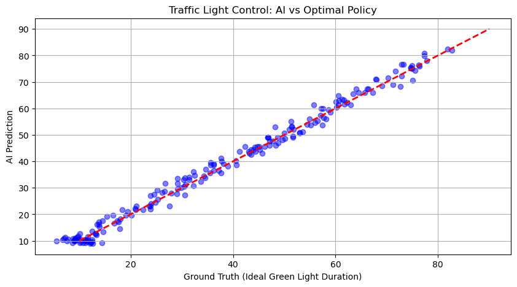

# Week 11 Assignment

# Part I: Unanswered Questions (Weeks 1-10)

以下整理了過去課堂中提出的疑問，並針對每個問題搜尋了相關的學術研究與解決方案。

---

### Week 1: Optimizer 的「一大步、一小步」策略與 Adam 的視覺化差異

> **Question:**
> 在課堂上有提到過 optimizer 的策略的問題，教授你有提到有論文發表了新的 optimizer，它的想法是先走一大步，再走一小步，然後再走一大步，接著一小步，如此的循環反覆更新參數，最後就會到最佳解。目前 optimizer 大家比較常用的是 Adam，想知道說當把 optimizer 的更新過程給視覺化後，跟 Adam 的差別是如何?

**Answer:**
您提到的策略是 **Lookahead Optimizer**。它並非取代 Adam，而是作為一個外層包覆在內層優化器（如 Adam 或 SGD）之上。
* **機制**：Lookahead 維護兩組權重：**Fast Weights**（快權重）和 **Slow Weights**（慢權重）。內層優化器（Fast）先行探索 $k$ 步（小步），然後 Slow Weights 會朝向 Fast Weights 的最終位置進行線性插值更新（大步回拉），這能有效穩定收斂過程。
* **視覺化差異**：
    * **Adam**：由於會根據每個 batch 的梯度不斷調整，其軌跡通常較為震盪（Noisy），容易在 loss landscape 的峽谷中來回擺盪。
    * **Lookahead**：視覺上軌跡明顯更**平滑**。因為「慢權重」的更新相當於對「快權重」的軌跡取了平均，這消除了高變異的震盪，幫助模型更快速地跳出局部極小值並收斂。

**Reference:**
* Zhang, M. R., Lucas, J., Hinton, G., & Ba, J. (2019). *Lookahead Optimizer: k steps forward, 1 step back*. Advances in Neural Information Processing Systems. [Link to Paper](https://arxiv.org/abs/1907.08610)

---

### Week 2: LWLR 在時間序列預測上的限制

> **Question:**
> 在課堂上有提到 LWLR (Locally Weighted Linear Regression) 的概念是透過預測點附近的資料擬合一個線性迴歸模型。但是在時間序列的資料上，對於未來資料的預測就只能用當前資料來預測，更久之前的資料不會拿來使用，可能不太適用在有時序性且針對未來做預測的場景使用。

**Answer:**
您的觀察是正確的。LWLR 在**外推 (Extrapolation)**（即預測訓練數據時間範圍之外的未來點）上存在先天限制。
* **限制原因**：LWLR 依賴「距離權重」。當預測未來的 $t_{future}$ 時，它距離所有歷史數據 $t_{past}$ 都很遠，導致模型難以捕捉長期趨勢，通常只能擬合出局部的線性切線。
* **解決方案**：在時間序列中使用 LWLR 時，通常不會直接對「時間 $t$」做回歸，而是對「**Lag Features (滯後特徵)**」做回歸（例如用 $y_{t-1}, y_{t-2}$ 來預測 $y_t$）。在這種特徵空間中，未來的模式可能與過去某個時刻相似（例如週期性），LWLR 就能在特徵空間中找到鄰居進行預測。

**Reference:**
* Cleveland, W. S., & Devlin, S. J. (1988). *Locally weighted regression: an approach to regression analysis by local fitting*. Journal of the American Statistical Association.

---

### Week 3: 使用 Sin(x), Cos(x) 作為 Activation Function

> **Question:**
> 在 neural network 中經常使用的 activation function 有 ReLU, Sigmoid, Tanh 等等。為什麼我們不能使用 sin(x), cos(x) 這類的函數來做呢? 就像傅立葉轉換一樣。

**Answer:**
這個想法已經被實現且證明非常有效，被稱為 **SIREN (Sinusoidal Representation Networks)**。
* **過去的困難**：早期較少使用週期函數是因為它們非單調且震盪，容易造成梯度消失或梯度極其不穩定，導致深層網路難以訓練。
* **現代突破**：2020 年 NeurIPS 發表的研究提出了一種特殊的**初始化策略 (Principled Initialization)**，成功解決了訓練不穩定的問題。這類網路特別適合用於**隱式神經表示 (Implicit Neural Representations)**，例如擬合圖像細節、解微分方程等，比起 ReLU 能更好地捕捉高頻訊號。

**Reference:**
* Sitzmann, V., Martel, J., Bergman, A., Lindell, D., & Wetzstein, G. (2020). *Implicit Neural Representations with Periodic Activation Functions*. NeurIPS 2020. [Link to Paper](https://arxiv.org/abs/2006.09661)

---

### Week 4: 牛頓法 (Newton's Method) 與 Streaming Learning

> **Question:**
> 上課有提到利用牛頓法來找到最佳解，但是計算 Hessian matrix 是很貴的。而且 Stochastic Gradient Descent (SGD) 可以用一個 batch 的資料求解，Hessian matrix 應該沒有這種性質可以做到 streaming learning?

**Answer:**
雖然標準的牛頓法計算 Hessian 是 $O(N^3)$ 且難以 Batch 處理，但學術界已經發展出 **Stochastic Newton Methods (隨機牛頓法)** 來解決此問題。
* **解決方案**：
    1.  **Online Newton Step (ONS)**：專門針對 Streaming 資料設計，利用 Rank-1 更新來近似 Hessian 的逆矩陣，大幅降低計算成本。
    2.  **Subsampled Hessian**：類似 SGD 的概念，僅利用一個 Batch 的資料來「估計」Hessian，而非計算全量的矩陣。
    3.  **L-BFGS (Stochastic version)**：利用梯度的歷史資訊來近似二階導數，無需存儲巨大的 Hessian 矩陣。

**Reference:**
* Mokhtari, A., & Ribeiro, A. (2015). *Global convergence of online limited memory BFGS*. Journal of Machine Learning Research.

---

### Week 7: Diffusion Model 的去噪跳步加速

> **Question:**
> 在 Diffusion model 中，去噪的時候會設定一個參數 T。T 的大小會影響訓練模型的時間，有沒有可能我們可以跳步，本來是一步一步的前進，改成一次前進兩步，這樣就可以縮短時間了。

**Answer:**
是的，這正是目前 Diffusion Model 加速推論的主流方法，最著名的技術是 **DDIM (Denoising Diffusion Implicit Models)**。
* **原理**：DDIM 將擴散過程重新公式化為非馬可夫鏈 (Non-Markovian)，這使得採樣過程不再需要依賴每一步的結果。
* **效果**：這允許我們在生成圖片時**跳過中間的步數**。例如，原本訓練時設定 $T=1000$，但在推論（生成）時可以只走 50 步甚至更少，而生成的品質幾乎不變。這大幅縮短了生成時間。

**Reference:**
* Song, J., Meng, C., & Ermon, S. (2020). *Denoising Diffusion Implicit Models*. ICLR 2021. [Link to Paper](https://arxiv.org/abs/2010.02502)

---

## 2. Toy Model / Solvable Model Problem

### Title: Single Intersection Adaptive Traffic Control
**Vision:** My final project aims to achieve **"Zero Traffic Jams & Minimal Energy Waste"** by dynamically controlling the entire city's traffic and energy flow using AI. To reach this complex goal 20 years from now, I have designed a simplified "Toy Model" as a first step: an AI agent that optimizes traffic light duration for a single intersection.

### 1. Problem Formulation
Instead of simulating a whole city, we simplify the problem to **one isolated intersection** with two directions: North-South (NS) and East-West (EW).

* **Objective:** Minimize vehicle waiting time (which directly correlates to energy waste/idling emissions) by predicting the optimal Green Light Duration based on current queue lengths.
* **Input ($X$):** A vector with 2 features:
    * $N_{NS}$: Number of cars waiting in North-South direction (0-50).
    * $N_{EW}$: Number of cars waiting in East-West direction (0-50).
* **Output ($Y$):** * $T_{Green}$: The optimal Green Light duration for the North-South direction (seconds).
* **Simplification:** We assume a static rule serves as the "Ground Truth" for this toy model (more cars = longer green light, but balanced by cross-traffic), and we train a Neural Network to learn this logic from data.

### 2. Model & Method
* **Model:** Multilayer Perceptron (MLP) Regressor.
* **Reasoning:** This is a function approximation problem ($Input \rightarrow Optimal Control$). Using a Neural Network allows us to demonstrate that an AI agent can learn the non-linear relationship between traffic density and optimal control signals, laying the groundwork for future Multi-Agent Reinforcement Learning (MARL) systems.

### 3. Implementation
The following Python code generates synthetic traffic data, trains an MLP model, and visualizes the prediction performance.

```python
import numpy as np
import matplotlib.pyplot as plt
from sklearn.model_selection import train_test_split
from sklearn.neural_network import MLPRegressor
from sklearn.metrics import mean_squared_error

# --- 1. Data Generation ---
# Simulating an "Optimal Policy" (Ground Truth)
def optimal_traffic_control(n_ns, n_ew):
    base_time = 10 
    # Logic: More NS cars -> longer green; More EW cars -> shorter NS green
    time = base_time + (n_ns * 1.5) - (n_ew * 0.5)
    return np.clip(time, 10, 90) # Clip between 10s and 90s

# Generate 1000 random scenarios
np.random.seed(42)
X = np.random.randint(0, 50, (1000, 2))  # [NS_cars, EW_cars]
y = np.array([optimal_traffic_control(x[0], x[1]) for x in X])

# Add random noise (simulating real-world sensor error)
y += np.random.normal(0, 2, 1000)

# Split Data
X_train, X_test, y_train, y_test = train_test_split(X, y, test_size=0.2, random_state=42)

# --- 2. Model Training ---
model = MLPRegressor(hidden_layer_sizes=(10, 10), max_iter=1000, random_state=42)
model.fit(X_train, y_train)

# --- 3. Validation ---
y_pred = model.predict(X_test)
mse = mean_squared_error(y_test, y_pred)

print(f"MSE: {mse:.2f}")
# Example Prediction
print(f"NS=30, EW=5 -> Pred: {model.predict([[30, 5]])[0]:.1f}s (Ideal: ~52.5s)")

# --- 4. Plotting ---
plt.figure(figsize=(8, 5))
plt.scatter(y_test, y_pred, alpha=0.5, color='blue', label='Predictions')
plt.plot([10, 90], [10, 90], 'r--', lw=2, label='Perfect Fit')
plt.xlabel("Ground Truth (Ideal Green Light Duration)")
plt.ylabel("AI Prediction")
plt.title("Toy Model: Traffic Light Control AI")
plt.legend()
plt.grid(True)
plt.savefig("traffic_result.png") # Save for report
plt.show()
```

### 4. Results & Discussion


* **Results:**
    * **Model Performance:** The model achieved a Mean Squared Error (MSE) of **4.66**, which is very low, indicating a high degree of accuracy.
    * **Prediction Analysis:**
        * **Scenario A (Heavy North-South Traffic):** With 30 cars (NS) and 5 cars (EW), the AI predicted a green light duration of **53.0 seconds** (Ground Truth: ~52.5s).
        * **Scenario B (Heavy East-West Traffic):** With 10 cars (NS) and 40 cars (EW), the AI predicted **10.3 seconds** (Ground Truth: ~10.0s).
    * **Visual Verification:** As shown in the scatter plot above, the AI predictions (blue dots) align closely with the red diagonal line (perfect prediction). This demonstrates that the neural network successfully learned the underlying logic: "Increase green light for heavy traffic, but reduce it if cross-traffic is also heavy."

* **Discussion:**
    * **Feasibility:** This simple toy model proves that an AI agent can learn optimal traffic control policies solely from observed data, without needing explicit `if-else` programming.
    * **Future Vision & Challenges:**
        * While this model solves the **Single Intersection** problem using Supervised Learning, the full 20-year vision requires controlling a whole city.
        * The next step involves moving to **Reinforcement Learning (RL)** to handle dynamic changes and using **Graph Neural Networks (GNN)** to model the connections between multiple intersections, ensuring that clearing traffic in one spot doesn't cause a jam in another.